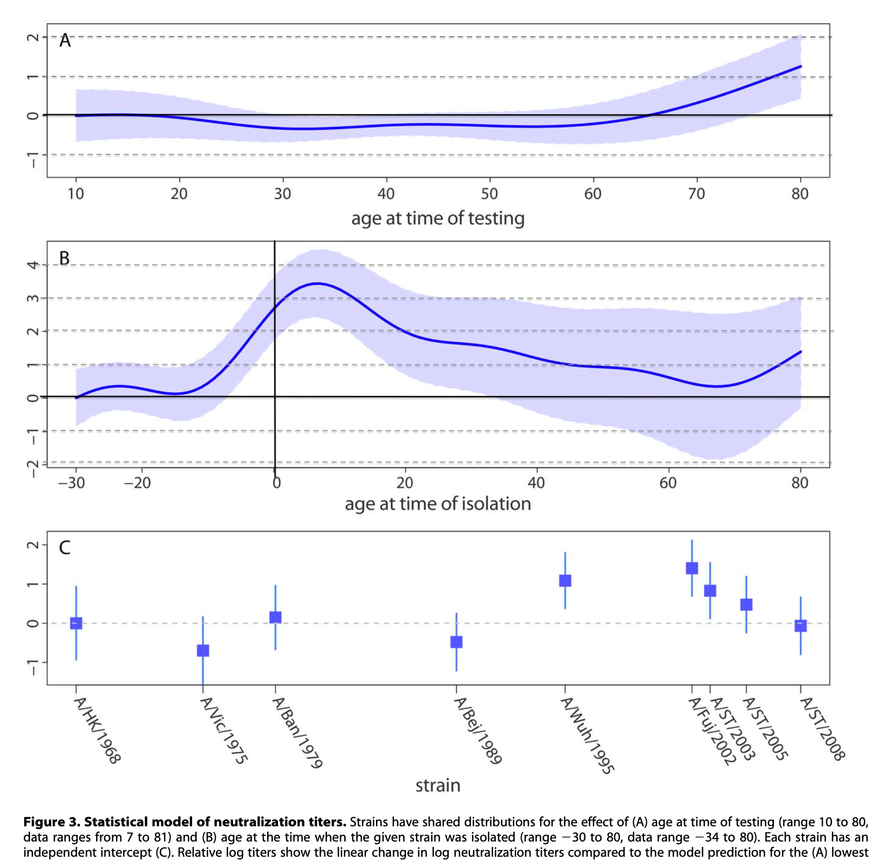

# Refit models from [Lessler et. al., 2012, PLOS Pathogens](https://journals.plos.org/plospathogens/article?id=10.1371/journal.ppat.1002802)

## Evidence for Antigenic Seniority in Influenza A (H3N2) Antibody Responses in Southern China

[Lessler et. al., 2012](https://journals.plos.org/plospathogens/article?id=10.1371/journal.ppat.1002802) fit three models to neutralization titer data from the Fluscape Study.

Quoting from their [supplementary methods](https://doi.org/10.1371/journal.ppat.1002802.s014), these models are:


(A) $log(y_{ij})=\alpha_j+\beta S(x_i)+\gamma S(x_i-q_j)$

> The relationship between neutralization titer and age is dependent only on the age at time of strain isolation and age at time of testing (relative BIC 0.0).

* $y_{ij}$ is the neutralization titer to strain j observed in person i.
* $a_j$ is the strain specific intercept.
* $\beta$ and $\gamma$ are fitted vectors of spine coefficients.
* $S(.)$ indicates a smoothing spline.

(B)  $log(y_{ij})=\alpha_j+\beta_j S(x_i)$

>The relationship between neutralization titer and age (at time of testing) is unique to each strain (relative BIC 206.4). 

* $\beta_j$ is a strain-specific vector of spine coefficients.

(C)  $log(y_{ij})=\alpha_j+\delta_i+\gamma S(x_i-q_j)$

>Each individual has a random intercept and there is a common effect of age at time of strain isolation (relative BIC 542.9) and 

* $\delta_i$ is an individual-specific intercept.

(D)  $log(y_{ij})=\alpha_j+\delta_i+\beta_j S(x_i)$

>Individual random intercepts and a strain specific effect of age (relative BIC 654.3). 

* $\delta_i$ is an individual-specific intercept.


* Here, we download their [Supplementary Dataset S1]([Lessler et al 2012, PLOS Pathogens](https://journals.plos.org/plospathogens/article?id=10.1371/journal.ppat.1002802#s5) and use it to reproduce their analysis.
* The raw data are saved in ../data/journal.ppat.1002802.s001.CSV.


## Set up workspace

```{r, echo=F, message=F}
rm(list = ls()) ## clear memory
library(ggplot2) ## load packages
library(tidyverse)
filter <- dplyr::filter
```

## Load, format, and view the data

```{r}
lessler_data <- read_csv('../data/journal.ppat.1002802.s001.CSV') %>%
  extract(neut.against, into = 'circ.year', regex = '(\\d\\d\\d\\d)', remove = F) %>% ## Extract the year of strain circulation from the strain name
  mutate(circ.year = as.numeric(circ.year),
         birth.year = circ.year-shift.age) ## Calculate birth year for each pariticpant
lessler_data
```

## Plot the density of age at isolation


```{r}
lessler_data %>%
  mutate(bygrp = cut(birth.year, breaks = seq(1900, 2020, by = 5))) %>% # Group participants into 5-yr age bins
  group_by(id) %>%
  filter(titers == max(titers)) %>% # For each individual, keep the row showing the max titer
  ggplot()+
  geom_density(aes(x = shift.age), alpha = .3) +  # Plot the density of ages at the time of circulation of the strain with the highest titer
  xlab('age at isolation of peak titer strain') 
```
If we plot the density of age at isolation of peak titer strain, then we reproduce the patterns from Lessler et al., where peak titer occurs around 6 years of age.


## Re-fit  model A.

This is the best mdoel based on BIC, and the one presented in the main text figures.

```{r}
library(mgcv)

model_A_fit = mgcv::gam(titers ~ neut.against + s(age) + s(shift.age), data = lessler_data)
summary(model_A_fit)
```

## Plot model A fit

Use glm's bulit-in plotting function

```{r}
pl = plot(model_A_fit)
```


## Or, use this code to build a custom ggplot that reproduces Lessler et al. Fig. 3:

```{r fig.height=6.5, fig.width=8}
names(pl) = c('age at sampling', 'age at strain circulation')
spline_values = lapply(pl, function(ll){ tibble(x = ll$x,
                                                fit = as.numeric(ll$fit),
                                                lower = as.numeric(ll$fit-ll$se),
                                                upper = as.numeric(ll$fit+ll$se))}) %>%
  bind_rows(.id = 'variable') %>%
  # Adjust the age at time of circulation spline by the overall intercept
  mutate(fit = ifelse(variable == 'age at strain circulation', fit+model_A_fit$coefficients[1], fit),
         lower = ifelse(variable == 'age at strain circulation', lower+model_A_fit$coefficients[1], lower),
         upper = ifelse(variable == 'age at strain circulation', upper+model_A_fit$coefficients[1], upper)) 

##  Get axis limits
smax <- spline_values %>% group_by(variable) %>% summarise(smax = x[which(fit ==max(fit))])
smax[1,2] = NA

## Get fitted intercepts and SE
intercepts <- tibble(name = names(summary(model_A_fit)$p.coef), 
                     intercept = summary(model_A_fit)$p.coef,
                     se = summary(model_A_fit)$se[!grepl('age', names(summary(model_A_fit)$se))]) %>% # Extract intercepts and se from model fits
  mutate(strain = str_replace(name, pattern = 'neut.against\\d ', replacement = ''),  # Extract strain number
         strain = str_replace(strain, '\\(H3N2\\)', ''), 
         lower = intercept-1.96*se,
         upper = intercept+1.96*se) %>%
  select(strain, intercept, lower, upper) %>% # Reorganize tibble
  extract(strain, into = 'strain_year', regex = 'A/\\w+/(\\d+)', remove = F, convert = T)
intercepts$strain_year[1] = 1968
## We are plotting relative intercepts, so set the reference estimate to 0
intercepts$lower[1] = intercepts$lower[1]-intercepts$intercept[1]
intercepts$upper[1] = intercepts$upper[1]-intercepts$intercept[1]
intercepts$intercept[1] = 0

plot.spline.1 <- spline_values %>%
  filter(variable == 'age at sampling') %>%
  ggplot()+
  geom_ribbon(aes(x = x, ymin = lower, ymax = upper), fill = 'salmon2', alpha = .5)+
  geom_line(aes(x = x, y = fit), color = 'salmon2')+
  xlab('age at time of testing') +
  ylab('gam smooth') +
  geom_vline(aes(xintercept = 0), lty = 1)+
  geom_hline(aes(yintercept = 0)) 

plot.spline.2 <- spline_values %>%
  filter(variable == 'age at strain circulation') %>%
  ggplot()+
  geom_ribbon(aes(x = x, ymin = lower, ymax = upper), fill = 'deepskyblue', alpha = .5)+
  geom_line(aes(x = x, y = fit), color = 'deepskyblue')+
  xlab('age at time of isolation') +
  ylab('gam smooth') +
  geom_vline(aes(xintercept = 0), lty = 1)+
  geom_vline(data = smax, aes(xintercept = smax), lty = 2)+
  geom_hline(aes(yintercept = 0)) +
  geom_label(data = smax, aes(x = smax, y = -1, label = sprintf('%.1f', smax)))

plot.intercepts <- intercepts %>%
  ggplot()+
  geom_point(aes(x = strain_year, y = intercept))+
  geom_segment(aes(x = strain_year, xend = strain_year, y = lower, yend = upper)) +
  geom_hline(aes(yintercept = 0), lty = 2) +
  ylab('gam intecept')+
  theme(axis.text.x = element_text(angle = 45, hjust = 1))

plot.out <- cowplot::plot_grid(plot.spline.1,
                               plot.spline.2,
                               plot.intercepts,
                               nrow = 3,
                               rel_heights = c(1,1,1.5))
plot.out
```


## Compare to actual fits from paper

These are similar but not identical. Key differences:

1. The age at time of isolation spline is shifted up in my analysis.
2. The credible intervals around the age at time of isolation spline look wider in the original paper.





